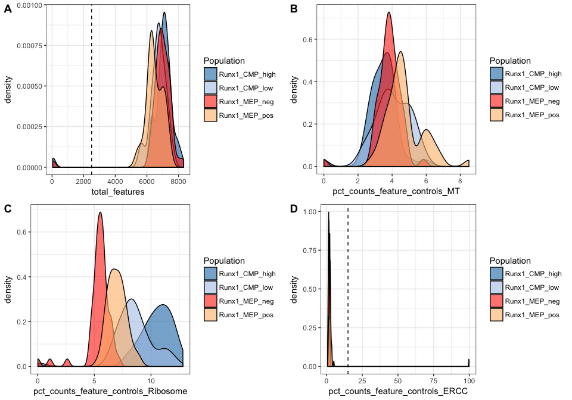
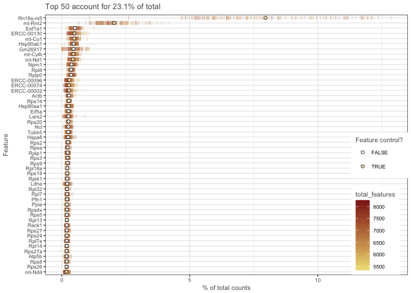
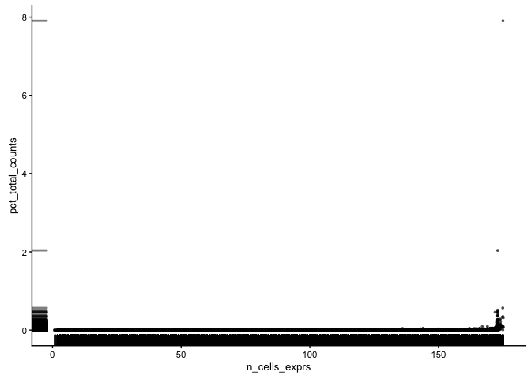
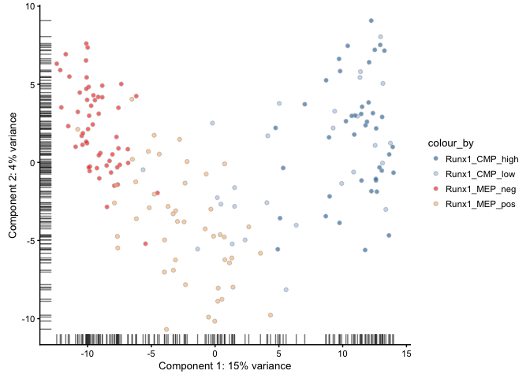
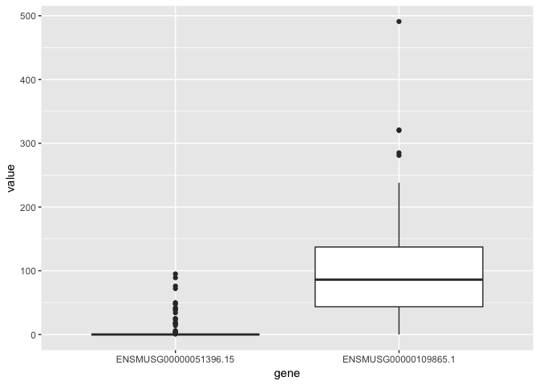
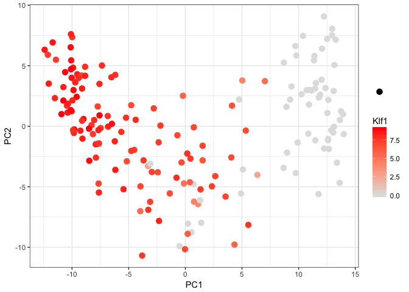
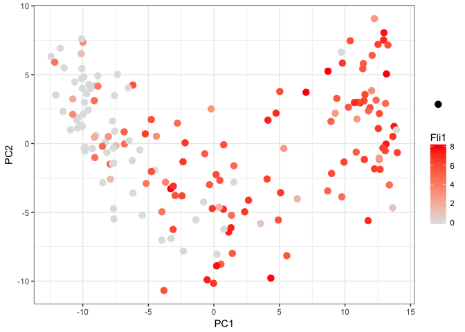
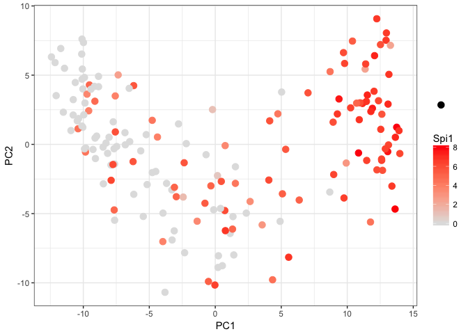

Pre-processing of sequence data
===============================

Create reference genome
-----------------------

Genome sequence was downloaded from <http://ftp.ensembl.org/pub/release-87/fasta/mus_musculus/dna/>. GTF file was downloaded from Gencode at <ftp://ftp.sanger.ac.uk/pub/gencode/Gencode_mouse/release_M12/gencode.vM12.annotation.gtf.gz>.

Since gencode **GTF** file contains `chr`. We need to edit the gencode **GTF** file to contain the same annotation as ensembl reference. Edit the **GTF** by doing the following ;

1.  Remove `chr`
2.  Rename `chrMT` to `chrM`.

``` bash
cat gencode.vM12.annotation.gtf | sed 's/^chrM/chrMT/'  | sed 's/^chr//' > gencode.vM12.annotation_edit.gtf
```

ERCC sequence and gtf files are donwloaded from <https://tools.thermofisher.com/content/sfs/manuals/ERCC92.zip>. We combine the ERCC **GTF** file with the edited Gencode genome **GTF**.

``` bash
cat gencode.vM12.annotation_edit.gtf ${ERCCgtf} > ${outDir}/gencode_ERCC.gtf
```

Merging lane-wise fastq files
-----------------------------

For each sample (or single cell), the sample was sequenced across 4 lanes as shown below.

``` r
C208_MEP_neg_L001_R1.fastq.gz
C208_MEP_neg_L002_R1.fastq.gz
C208_MEP_neg_L003_R1.fastq.gz
C208_MEP_neg_L004_R1.fastq.gz

C208_MEP_neg_L001_R2.fastq.gz
C208_MEP_neg_L002_R2.fastq.gz
C208_MEP_neg_L003_R2.fastq.gz
C208_MEP_neg_L004_R2.fastq.gz
```

We merged the lane-wise fastq files for each sample

``` r
cat C208_MEP_neg_L001_R1.fastq.gz C208_MEP_neg_L002_R1.fastq.gz C208_MEP_neg_L003_R1.fastq.gz C208_MEP_neg_L004_R1.fastq.gz > C208_MEP_neg_R1.fastq.gz


cat C208_MEP_neg_L001_R2.fastq.gz C208_MEP_neg_L002_R2.fastq.gz C208_MEP_neg_L003_R2.fastq.gz C208_MEP_neg_L004_R2.fastq.gz > C208_MEP_neg_R2.fastq.gz
```

Read trimming
-------------

We applied read trimming using trimmomatic (version 0.36) with the following settings.

``` r
{trimmomatic} PE -threads {num_threads} -phred33 {r1_input} {r2_input} {Trimmomatic_Output}_r1_paired.fq {Trimmomatic_Output}_r1_unpaired.fq {Trimmomatic_Output}_r2_paired.fq {Trimmomatic_Output}_r2_upaired.fq ILLUMINACLIP:$TRIMMOMATICDIR/share/adapters/TruSeq3-PE-2.fa:2:30:10 CROP:75 HEADCROP:5 SLIDINGWINDOW:20:20 MINLEN:36
```

The file `TruSeq3-PE-2.fa` was downloaded from <https://github.com/timflutre/trimmomatic/blob/master/adapters/TruSeq3-PE-2.fa>.

Mapping
-------

Mapping was performed with STAR (version 2.4.2a). Genome index was build with Genome + ERCC reference combined.

``` r
STAR --runThreadN 5 \
--runMode genomeGenerate \
--genomeDir ${outIndex} \
--genomeFastaFiles ${REF}/Mus_musculus.GRCm38.dna.chromosome.1.fa ${REF}/Mus_musculus.GRCm38.dna.chromosome.2.fa ${REF}/Mus_musculus.GRCm38.dna.chromosome.3.fa ${REF}/Mus_musculus.GRCm38.dna.chromosome.4.fa ${REF}/Mus_musculus.GRCm38.dna.chromosome.5.fa ${REF}/Mus_musculus.GRCm38.dna.chromosome.6.fa ${REF}/Mus_musculus.GRCm38.dna.chromosome.7.fa ${REF}/Mus_musculus.GRCm38.dna.chromosome.8.fa ${REF}/Mus_musculus.GRCm38.dna.chromosome.9.fa ${REF}/Mus_musculus.GRCm38.dna.chromosome.10.fa ${REF}/Mus_musculus.GRCm38.dna.chromosome.11.fa ${REF}/Mus_musculus.GRCm38.dna.chromosome.12.fa ${REF}/Mus_musculus.GRCm38.dna.chromosome.13.fa ${REF}/Mus_musculus.GRCm38.dna.chromosome.14.fa ${REF}/Mus_musculus.GRCm38.dna.chromosome.15.fa ${REF}/Mus_musculus.GRCm38.dna.chromosome.16.fa ${REF}/Mus_musculus.GRCm38.dna.chromosome.17.fa ${REF}/Mus_musculus.GRCm38.dna.chromosome.18.fa ${REF}/Mus_musculus.GRCm38.dna.chromosome.19.fa ${REF}/Mus_musculus.GRCm38.dna.chromosome.X.fa ${REF}/Mus_musculus.GRCm38.dna.chromosome.Y.fa ${REF}/Mus_musculus.GRCm38.dna.chromosome.MT.fa ${REF_ercc}/ERCC92.fa \
--sjdbGTFfile ${REF}/gencode_ERCC.gtf
```

Mapping was performed with the following parameters. Note we only mapped the "paired" fastq files.

``` r
STAR --runMode alignReads \
    --runThreadN {num_threads} \
    --genomeLoad LoadAndKeep \
    --genomeDir {genome_dir} \
    --readFilesIn {Trimmomatic_Output}_r1_paired.fq {Trimmomatic_Output}_r2_paired.fq \
    --outSAMtype BAM Unsorted \
    --outFileNamePrefix {STAR_output}
```

Counting reads
--------------

We used ht-seq (version 0.6.1p1) to generate the count table.

``` r
{htseq} --format=bam --stranded=reverse --type=exon --idattr=gene_id {STAR_output}Aligned.out.bam {ref_genome} > {htseq_output}.txt
```

The output of all samples was saved in a file called \`raw\_read\_counts.txt'. This file is also available from GEO with the GEO accession number [GSE107653](https://www.ncbi.nlm.nih.gov/geo/query/acc.cgi?acc=GSE107653).

Donwstream processing
=====================

Once we generated the count table using ht-seq, all further processing is conducted in R (**R version 3.4.0 (2017-04-21) -- "You Stupid Darkness"**). The Bioconductor version used is

``` r
source("http://bioconductor.org/biocLite.R")
```

    ## Bioconductor version 3.5 (BiocInstaller 1.26.1), ?biocLite for help

    ## A newer version of Bioconductor is available for this version of R,
    ##   ?BiocUpgrade for help

Creating scater sceObject
=========================

We created scater object using the count generated by ht-seq. These files are also available in GEO. The following files were downloaded from [GSE107653](https://www.ncbi.nlm.nih.gov/geo/query/acc.cgi?acc=GSE107653);

``` bash
GSE107653_raw_read_counts.txt
GSE107653_cell_annotation.txt
GSE107653_gene_annotation.txt
```

-   GSE107653\_raw\_read\_counts.txt - Contains the read count as obtained by ht-seq
-   GSE107653\_cell\_annotation.txt - Metadata of the cells
-   GSE107653\_gene\_annotation.txt - Annotation of the genes (extracted from the gencode GTF file)

We load the required library

``` r
library(scater)
library(ggplot2)
library(ggpubr)
```

    ## Warning: package 'ggpubr' was built under R version 3.4.1

``` r
library(dplyr)
```

    ## Warning: package 'dplyr' was built under R version 3.4.1

``` r
library(textclean)
library(knitr)
```

    ## Warning: package 'knitr' was built under R version 3.4.1

``` r
library(tidyr)
```

    ## Warning: package 'tidyr' was built under R version 3.4.1

``` r
library(DESeq2)
```

    ## Warning: package 'S4Vectors' was built under R version 3.4.1

    ## Warning: package 'IRanges' was built under R version 3.4.1

    ## Warning: package 'GenomicRanges' was built under R version 3.4.1

We specify directory structure

``` r
workDir <- "~/JuliaDraper_PLOSgenetics/JuliaDraper_PLOSgenetics/"
dataDir <- file.path(workDir, "data")
outDir <- file.path(workDir, "output")
```

We read the files were downloaded from [GSE107653](https://www.ncbi.nlm.nih.gov/geo/query/acc.cgi?acc=GSE107653).

``` r
count <- read.delim(file.path(dataDir, "GSE107653_raw_read_counts.txt"))
cell_anno <-  read.delim(file.path(dataDir, "GSE107653_cell_annotation.txt"),
                         stringsAsFactors = FALSE)
gene_anno <-  read.delim(file.path(dataDir, "GSE107653_gene_annotation.txt"),
                         stringsAsFactors = FALSE)
```

We have a look at the count table

``` r
count[1:5,1:5]
```

    ##                       X C208_MEP_neg C209_MEP_neg C210_MEP_neg
    ## 1  ENSMUSG00000000001.4           32           74            3
    ## 2 ENSMUSG00000000003.15            0            0            0
    ## 3 ENSMUSG00000000028.14           27          155           29
    ## 4 ENSMUSG00000000031.15            0            0            0
    ## 5 ENSMUSG00000000037.16            0            0            0
    ##   C211_MEP_neg
    ## 1           96
    ## 2            0
    ## 3           23
    ## 4            0
    ## 5            0

Some editing needs to be done on the count table;

1.  The gene id needs to be as row.names
2.  The ht-seq information needs to be removed

Changing the gene id to row.names

``` r
row.names(count)  <- count$X
count <- count[,-1]
count[1:5,1:5]
```

    ##                       C208_MEP_neg C209_MEP_neg C210_MEP_neg C211_MEP_neg
    ## ENSMUSG00000000001.4            32           74            3           96
    ## ENSMUSG00000000003.15            0            0            0            0
    ## ENSMUSG00000000028.14           27          155           29           23
    ## ENSMUSG00000000031.15            0            0            0            0
    ## ENSMUSG00000000037.16            0            0            0            0
    ##                       C212_MEP_neg
    ## ENSMUSG00000000001.4            43
    ## ENSMUSG00000000003.15            0
    ## ENSMUSG00000000028.14          197
    ## ENSMUSG00000000031.15            0
    ## ENSMUSG00000000037.16            0

Removing the ht-seq information. This is how the count table looks **BEFORE** removing the ht-seq information

``` r
tail(count)[1:6,1:3]
```

    ##                        C208_MEP_neg C209_MEP_neg C210_MEP_neg
    ## ERCC-00171                      210          254          290
    ## __alignment_not_unique       264142       241264       266867
    ## __ambiguous                  178538       127735       146150
    ## __no_feature                  58404        36533        41919
    ## __not_aligned                     0            0            0
    ## __too_low_aQual                   0            0            0

This is how the count table looks **AFTER** removing the ht-seq information

``` r
count <-count[-grep("_", row.names(count)), ]
tail(count)[1:6,1:3]
```

    ##            C208_MEP_neg C209_MEP_neg C210_MEP_neg
    ## ERCC-00163            0            0            0
    ## ERCC-00164            0            0            0
    ## ERCC-00165           52            0            0
    ## ERCC-00168            0            0            0
    ## ERCC-00170            0            0            0
    ## ERCC-00171          210          254          290

Creating phenoData

``` r
# -------- #
# Creating the metaData (pheno Data) - containing the cell identity mapping percentage...etc
# -------- #
pheno_df <- cell_anno
# Check if the order of the cell in the pheno data is the same as count table
identical(pheno_df$Cell, colnames(count))
```

    ## [1] TRUE

``` r
# Make the pheno Data
pheno_data <- new("AnnotatedDataFrame", pheno_df)
rownames(pheno_data) <- pheno_data$Cell
```

Creating featureData

``` r
# -------- #
# Creating the metaData (feature Data) - containing the gene symbol annotation
# -------- #
feature_df <- gene_anno
# Check if the order of genes in the annotation file is the same as count table
identical(feature_df$gene_id, row.names(count))
```

    ## [1] TRUE

``` r
# Make the featureData
feature_data <- new("AnnotatedDataFrame", feature_df)
rownames(feature_data) <- feature_data$gene_id
```

Finally make the sceSet

``` r
sce <- scater::newSCESet(
  countData = count,
  phenoData = pheno_data,
  featureData = feature_data)
```

Save the sceSet to disk

``` r
save(sce, file=file.path(outDir, "sce.Robj"))
```

Cell and Gene filtering
=======================

Lets run the QC

``` r
sce_1 <- 
  calculateQCMetrics(sce,
                     feature_controls = list(ERCC = fData(sce)$gene_type == "ERCC",
                                             MT= fData(sce)$seqnames == "MT",
                                             Ribosome = fData(sce)$gene_type == "rRNA")
                     )
```

Cell filtering
--------------

Lets plot a few histogram to get the distribution of the data. First we apply a filter based on mapping percentage.

``` r
# The colour scheme we use
colp <- c("#1F77B4","#AEC7E8","#FF2E0E", "#FFBB78")


df_pData <- pData(sce_1)

p1 <- 
  ggplot(df_pData, aes(x=UnMap_per, fill=Population)) +
  geom_density(alpha=0.6) +
  theme_bw() +
  geom_vline(xintercept = 25, linetype="dashed") +
  scale_fill_manual(
    values=colp)

p2 <- 
    ggplot(df_pData, aes(x=TotalReads, fill=Population)) +
  geom_density(alpha=0.6) +
  theme_bw() +
  geom_vline(xintercept = 250000, linetype="dashed") +
  scale_fill_manual(
    values=colp)

#scater::multiplot(p1,p2, cols=1)

ggarrange(nrow=2, p1,p2, labels = c("A", "B"))
```


From a quick observation of the plots, we will use the following cut-off.

-   Remove cells with unmapped reads more than 25%
-   Remove cells with reads less than 250,000

Second we filter the cells based on other criteria ;

-   Number of genes detected
-   Percentage of Mitochondira reads
-   Percentage of Ribosome reads
-   Percentage of ERCC

Another measure of quality is the proportion of reads mapped to genes in the mitochondrial genome. High proportions are indicative of poor-quality cells ([Ilicic et al, 2016](https://f1000research.com/articles/5-2122/v2#ref-14), [Islam et al., 2014](https://f1000research.com/articles/5-2122/v2#ref-16)), possibly because of increased apoptosis and/or loss of cytoplasmic RNA from lysed cells.

``` r
p1 <- 
  ggplot(df_pData, aes(x=total_features, fill=Population)) +
  geom_density(alpha=0.6) +
  theme_bw()  +
  geom_vline(xintercept = 2500, linetype="dashed") +
  scale_fill_manual(
    values=colp)

p2 <- 
  ggplot(df_pData, aes(x=pct_counts_feature_controls_MT, fill=Population)) +
  geom_density(alpha=0.6) +
  theme_bw() +
  scale_fill_manual(
    values=colp)

p3 <- 
  ggplot(df_pData, aes(x=pct_counts_feature_controls_Ribosome, fill=Population)) +
  geom_density(alpha=0.6) +
  theme_bw() +
  scale_fill_manual(
    values=colp)

p4 <- 
  ggplot(df_pData, aes(x=pct_counts_feature_controls_ERCC, fill=Population)) +
  geom_density(alpha=0.6) +
  theme_bw() +
  geom_vline(xintercept = 15, linetype="dashed") +
  scale_fill_manual(
    values=colp)


#scater::multiplot(p1,p2,p3,p4,cols=2)

ggarrange(p1,p2, p3, p4, labels = c("A", "B", "C", "D"))
```



We note the following observation form the plot

-   A - most cells detected more than 5000 genes
-   B - Percentage of mitochondia is about 2-4%. Low percentage is ideal
-   C - Simillar percentage or ribosome across cell. Low percentage is ideal
-   D - ERCC percentage : The ERCC is not dominating huge number of reads, which is ideal one or two cell have ~100% ERCC

Now lets apply the filtering. We apply the filtering based on these threshold

``` r
# Threshold used
t_unmap <- 25
t_reads <- 250000
t_features <- 2500
t_MT <- 15
t_Ribo <- 15
t_ERCC <- 15


df_filter <- dplyr::filter(df_pData, 
                           UnMap_per <=t_unmap & 
                             TotalReads >= t_reads &
                             total_features >= t_features &
                             pct_counts_feature_controls_MT <= t_MT &
                             pct_counts_feature_controls_Ribosome <= t_Ribo &
                             pct_counts_feature_controls_ERCC <= t_ERCC)
```

The initial number of cells were **175**, after filtering the number becomes **172**. Therefore **3 **cells were removed

``` r
sce_Cellfilter <- sce_1[ , sce_1$Cell %in% df_filter$Cell]
```

Gene filtering
--------------

We conduct two stage of gene filtering ;

1.  Removing low-abundance genes
2.  Remove over-represented genes

### Low abundance

Low-abundance genes are problematic as zero or near-zero counts do not contain enough information for reliable statistical inference. In addition, the discreteness of the counts may interfere with downstream statistical procedures, e.g., by compromising the accuracy of continuous approximations. These genes are likely to be dominated by drop-out events [Brennecke et al., 2013](https://www.nature.com/nmeth/journal/v10/n11/full/nmeth.2645.html), which limits their usefulness in later analyses. Removal of these genes mitigates discreteness and reduces the amount of computational work without major loss of information.

Here, low-abundance genes are defined as ;

-   Those with an average count below a filter threshold of 1.
-   Expressed in at less than 3 cells

Filtering by average count

``` r
ave.counts <- rowMeans(counts(sce_Cellfilter))
keep <- ave.counts >= 1
print(paste0("Before filtering Gene Numbers (including the 0 expression ones): ", dim(fData(sce_Cellfilter))[1]))
```

    ## [1] "Before filtering Gene Numbers (including the 0 expression ones): 49677"

``` r
print(paste0('After filtering Gene Numbers: ',sum(keep)))
```

    ## [1] "After filtering Gene Numbers: 11912"

``` r
sce_Genefilter <- sce_Cellfilter[keep, ]
```

Over-represented
----------------

Plotting the over-represented genes

We plot it as gene names

``` r
top_n <- 50
top50 <- head(dplyr::arrange(fData(sce_Genefilter), desc(pct_total_counts)) %>% select(pct_total_counts, gene_id, gene_name), n=top_n)
```

We want to plot the over-represented using thier gene symbole

``` r
# Use the package (textclean) and mgsub function
top50_sceSet <- sce_Genefilter
featureNames(top50_sceSet) <- 
  mgsub(featureNames(top50_sceSet), top50$gene_id, top50$gene_name)
```

Overrepresented genes

``` r
plotQC(top50_sceSet, type = "highest-expression", n=50)
```



Another way to look at the data

``` r
plotFeatureData(sce_Genefilter, aes(x = n_cells_exprs, y = pct_total_counts))
```



One gene is taking about 20% of sequencing reads in all the cells, another gene is taking about 6%. We have a look at this top 3 genes to see what they are.

``` r
df_fData <- fData(sce_Genefilter)
knitr::kable(
dplyr::select(df_fData, gene_id, gene_name, gene_type, seqnames, exprs_rank, n_cells_exprs, pct_total_counts) %>%
  dplyr::arrange(desc(exprs_rank)) %>%
  dplyr::top_n(5, exprs_rank)
)
```

| gene\_id              | gene\_name | gene\_type      | seqnames   |  exprs\_rank|  n\_cells\_exprs|  pct\_total\_counts|
|:----------------------|:-----------|:----------------|:-----------|------------:|----------------:|-------------------:|
| ENSMUSG00000106106.2  | Rn18s-rs5  | rRNA            | 17         |        49677|              175|           7.9059466|
| ENSMUSG00000064339.1  | mt-Rnr2    | Mt\_rRNA        | MT         |        49676|              173|           2.0386014|
| ERCC-00130            | ERCC-00130 | ERCC            | ERCC-00130 |        49675|              175|           0.5686005|
| ENSMUSG00000037742.14 | Eef1a1     | protein\_coding | 9          |        49674|              173|           0.5135107|
| ENSMUSG00000064351.1  | mt-Co1     | protein\_coding | MT         |        49673|              173|           0.4842978|

We set a threshold of 5% pct\_total\_conts and remove these two genes

``` r
keep <- df_fData$pct_total_counts <=5 
print(paste0("Before filtering Gene Numbers: ", dim(fData(sce_Genefilter))[1]))
```

    ## [1] "Before filtering Gene Numbers: 11912"

``` r
print(paste0('After filtering Gene Numbers: ',sum(keep)))
```

    ## [1] "After filtering Gene Numbers: 11911"

``` r
sce_Genefilter <- sce_Genefilter[keep, ]
```

PCA plot
========

We reproduce some results in the paper. The first is the PCA plot

``` r
sce <-  sce_Genefilter

p1 <- scater::plotPCA(sce, colour_by="Population", exprs_values="exprs") +
  scale_fill_manual(values = colp)
```

    ## Scale for 'fill' is already present. Adding another scale for 'fill',
    ## which will replace the existing scale.

``` r
p1
```



Collapsing gene id to gene symbol
=================================

A good thing to do now is to use the gene symbol as the featureData. We check if there are any duplicated genes

``` r
df_fData <- fData(sce)
sum(duplicated(df_fData$gene_name))
```

    ## [1] 1

There is 1 duplicated gene symbol. What is this gene?

``` r
df_fData$gene_name[duplicated(df_fData$gene_name)]
```

    ## [1] "Hspa14"

Lets have a look at the count of this gene

``` r
loc_gene <- df_fData$gene_name == "Hspa14"
g1 <- scater::get_exprs(sce, "counts")[loc_gene, ]
df_g <- as.data.frame(g1)
df_g1 <- df_g
df_g1$gene <- row.names(df_g)
dat <- gather(df_g1, gene)
colnames(dat) <- c("gene", "Cell", "value")
ggplot(dat, aes(x=gene, y=value)) +
  geom_boxplot()
```



We remove the ensemble gene with the lower count

``` r
rowSums(df_g)
```

    ## ENSMUSG00000051396.15  ENSMUSG00000109865.1 
    ##                   853                 16771

``` r
fNames <- featureNames(sce)
loc_f <- fNames == "ENSMUSG00000051396.15"
sce_ori <- sce
sce <- sce_ori[!loc_f,]
featureNames(sce) <- fData(sce)$gene_name
```

We plot the expression of some genes as in the paper.

``` r
p <- scater::plotPCA(sce, colour_by="Klf1")
p5 <- p$data 
colnames(p5) <- c("PC1", "PC2", "Klf1", "size")
ggplot(p5, aes(x=PC1, y=PC2, colour=Klf1, size=size)) +
  geom_point() +
  scale_colour_gradient(low = "gray88", high = "red1") +
  scale_size_manual(values=3, labels="", name="") +
  theme_bw()
```



``` r
p <- scater::plotPCA(sce, colour_by="Fli1")
p6 <- p$data 
colnames(p6) <- c("PC1", "PC2", "Fli1", "size")
ggplot(p6, aes(x=PC1, y=PC2, colour=Fli1, size=size)) +
  geom_point() +
  scale_colour_gradient(low = "gray88", high = "red1") +
  scale_size_manual(values=3, labels="", name="") +
  theme_bw()
```



``` r
p <- scater::plotPCA(sce, colour_by="Spi1")
p6 <- p$data 
colnames(p6) <- c("PC1", "PC2", "Spi1", "size")
ggplot(p6, aes(x=PC1, y=PC2, colour=Spi1, size=size)) +
  geom_point() +
  scale_colour_gradient(low = "gray88", high = "red1") +
  scale_size_manual(values=3, labels="", name="") +
  theme_bw()
```



Differential Expression
=======================

We perform differential expression with DESeq2.

``` r
out_m1 <- file.path(outDir, "DESeq2")
if (dir.exists(out_m1)){
  print("Folder exist")
} else {
  dir.create(out_m1)
}
```

    ## [1] "Folder exist"

We filter genes with more than 75% dropouts.

``` r
cts <- get_exprs(sce, "counts")
cts_sub <- cts[fData(sce)$pct_total_exprs >= 0.0025,]
# Remove ERCC
cts_sub <- cts_sub[-grep("ERCC", row.names(cts_sub)),]
```

``` r
print(paste0("Before filtering Gene Numbers: ", nrow(cts)))
```

    ## [1] "Before filtering Gene Numbers: 11910"

``` r
print(paste0('After filtering Gene Numbers: ', nrow(cts_sub)))
```

    ## [1] "After filtering Gene Numbers: 9025"

Get some metadata

``` r
meta_df <- pData(sce)
meta_df <- dplyr::select(meta_df, Population)
```

Creating DEseq object

``` r
dds <- DESeqDataSetFromMatrix(countData = cts_sub,
                              colData = meta_df,
                              design = ~ Population)
dds <- DESeq(dds)
```

### Extracting results from Runx1\_MEP\_pos vs Runx1\_MEP\_neg

``` r
res <- DESeq2::results(dds, contrast=c("Population","Runx1_MEP_pos","Runx1_MEP_neg"))
resOrdered <- res[order(res$padj),]

write.table(resOrdered, file.path(out_m1, "Runx1_MEP.xls"), quote=F, sep="\t",col.names=NA)
```

### Extracting results from Runx1\_CMP\_high vs Runx1\_CMP\_low

``` r
res <- DESeq2::results(dds, contrast=c("Population","Runx1_CMP_high","Runx1_CMP_low"))
resOrdered <- res[order(res$padj),]

write.table(resOrdered, file.path(out_m1, "Runx1_CMP.xls"), quote=F, sep="\t",col.names=NA)
```

SessionInfo
===========

``` r
sessionInfo()
```

    ## R version 3.4.0 (2017-04-21)
    ## Platform: x86_64-apple-darwin15.6.0 (64-bit)
    ## Running under: macOS Sierra 10.12.5
    ## 
    ## Matrix products: default
    ## BLAS: /Library/Frameworks/R.framework/Versions/3.4/Resources/lib/libRblas.0.dylib
    ## LAPACK: /Library/Frameworks/R.framework/Versions/3.4/Resources/lib/libRlapack.dylib
    ## 
    ## locale:
    ## [1] en_GB.UTF-8/en_GB.UTF-8/en_GB.UTF-8/C/en_GB.UTF-8/en_GB.UTF-8
    ## 
    ## attached base packages:
    ## [1] stats4    parallel  stats     graphics  grDevices utils     datasets 
    ## [8] methods   base     
    ## 
    ## other attached packages:
    ##  [1] bindrcpp_0.2               DESeq2_1.16.1             
    ##  [3] SummarizedExperiment_1.6.3 DelayedArray_0.2.7        
    ##  [5] matrixStats_0.52.2         GenomicRanges_1.28.5      
    ##  [7] GenomeInfoDb_1.12.2        IRanges_2.10.3            
    ##  [9] S4Vectors_0.14.4           tidyr_0.7.1               
    ## [11] knitr_1.17                 textclean_0.3.1           
    ## [13] dplyr_0.7.3                ggpubr_0.1.5              
    ## [15] magrittr_1.5               scater_1.4.0              
    ## [17] ggplot2_2.2.1              Biobase_2.36.2            
    ## [19] BiocGenerics_0.22.0        BiocInstaller_1.26.1      
    ## 
    ## loaded via a namespace (and not attached):
    ##  [1] bitops_1.0-6            bit64_0.9-7            
    ##  [3] RColorBrewer_1.1-2      rprojroot_1.2          
    ##  [5] tools_3.4.0             backports_1.1.0        
    ##  [7] R6_2.2.2                rpart_4.1-11           
    ##  [9] vipor_0.4.5             Hmisc_4.0-3            
    ## [11] DBI_0.7                 lazyeval_0.2.0         
    ## [13] colorspace_1.3-2        nnet_7.3-12            
    ## [15] gridExtra_2.3           bit_1.1-12             
    ## [17] compiler_3.4.0          htmlTable_1.9          
    ## [19] labeling_0.3            checkmate_1.8.3        
    ## [21] scales_0.5.0            genefilter_1.58.1      
    ## [23] stringr_1.2.0           digest_0.6.12          
    ## [25] foreign_0.8-69          rmarkdown_1.6          
    ## [27] XVector_0.16.0          base64enc_0.1-3        
    ## [29] pkgconfig_2.0.1         htmltools_0.3.6        
    ## [31] highr_0.6               limma_3.32.6           
    ## [33] htmlwidgets_0.9         rlang_0.1.2            
    ## [35] RSQLite_2.0             shiny_1.0.5            
    ## [37] bindr_0.1               BiocParallel_1.10.1    
    ## [39] acepack_1.4.1           RCurl_1.95-4.8         
    ## [41] GenomeInfoDbData_0.99.0 Formula_1.2-2          
    ## [43] Matrix_1.2-11           Rcpp_0.12.12           
    ## [45] ggbeeswarm_0.6.0        munsell_0.4.3          
    ## [47] viridis_0.4.0           stringi_1.1.5          
    ## [49] yaml_2.1.14             edgeR_3.18.1           
    ## [51] zlibbioc_1.22.0         rhdf5_2.20.0           
    ## [53] plyr_1.8.4              grid_3.4.0             
    ## [55] blob_1.1.0              shinydashboard_0.6.1   
    ## [57] lattice_0.20-35         cowplot_0.8.0          
    ## [59] splines_3.4.0           annotate_1.54.0        
    ## [61] locfit_1.5-9.1          rjson_0.2.15           
    ## [63] geneplotter_1.54.0      reshape2_1.4.2         
    ## [65] biomaRt_2.32.1          XML_3.98-1.9           
    ## [67] glue_1.1.1              evaluate_0.10.1        
    ## [69] latticeExtra_0.6-28     data.table_1.10.4      
    ## [71] httpuv_1.3.5            gtable_0.2.0           
    ## [73] purrr_0.2.3             assertthat_0.2.0       
    ## [75] mime_0.5                xtable_1.8-2           
    ## [77] survival_2.41-3         viridisLite_0.2.0      
    ## [79] tibble_1.3.4            AnnotationDbi_1.38.2   
    ## [81] beeswarm_0.2.3          memoise_1.1.0          
    ## [83] tximport_1.4.0          cluster_2.0.6
